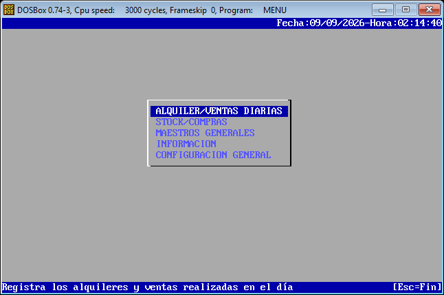
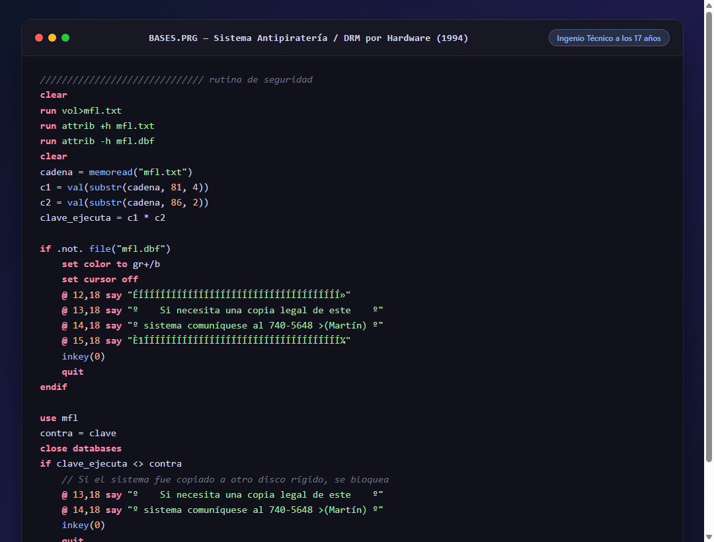
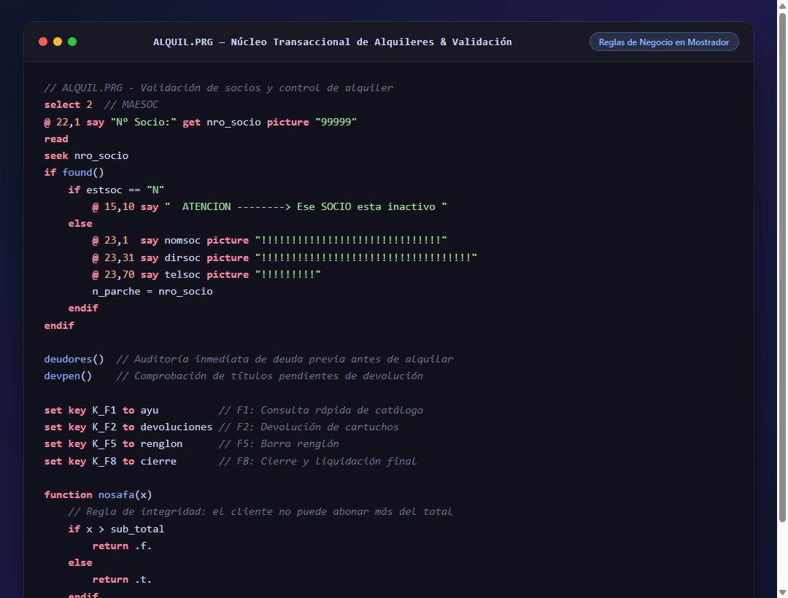
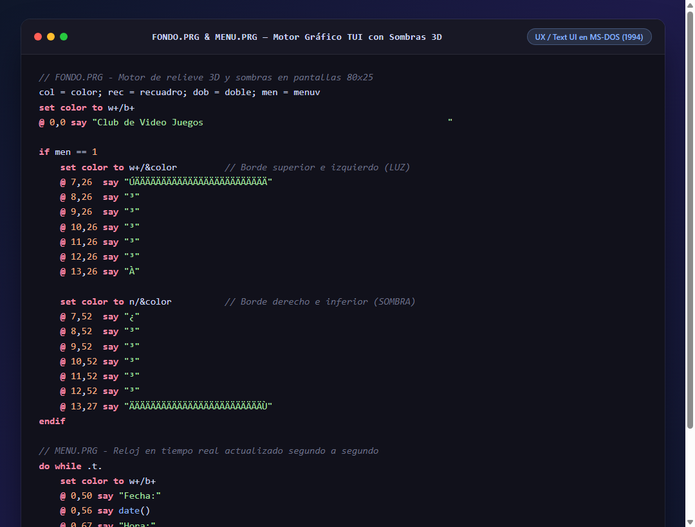
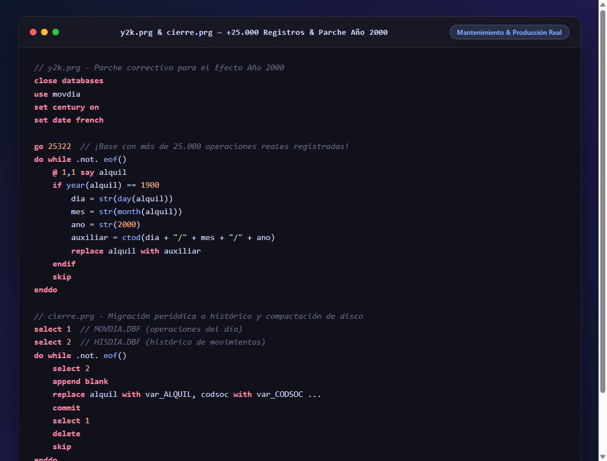

# 🕹️ MFL Sistemas — Sistema de Gestión para Club de Videojuegos & Videoclub (1994)
### *Desarrollado en CA-Clipper 5.x / MS-DOS a los 17 años*

[](https://es.wikipedia.org/wiki/MS-DOS)
[](https://en.wikipedia.org/wiki/Clipper_(programming_language))
[](https://en.wikipedia.org/wiki/DBase)
[](#)
[](#)

---

## 📖 El Origen: Programar en los años 90 a los 17 años

Hoy tengo **49 años** y miro este repositorio con una mezcla de orgullo, nostalgia y fascinación. 

Corrían mediados de los años 90 (alrededor de **1994**). No existían **Google, Stack Overflow, GitHub, YouTube ni Inteligencia Artificial**. Tampoco había internet de banda ancha ni foros inmediatos: se aprendía a fuerza de manuales impresos, ensayo, error, noches sin dormir frente a un monitor monocromo o VGA en MS-DOS, y mucha pasión autodidacta.

A los **17 años**, desarrollé este **sistema integral de gestión comercial (ERP)** para un negocio real de alquiler y venta de cartuchos de videojuegos (la época dorada de *Family Game, Sega Genesis y Super Nintendo*) y películas en VHS. El sistema no fue un ejercicio de estudio: **se vendió y se utilizó de forma real e ininterrumpida en un comercio durante 3 años**, llegando a procesar más de **25.000 operaciones registradas** en sus bases de datos.

Este repositorio preserva el código fuente original intacto como testimonio de mis inicios en la ingeniería de software.

---

## 🖥️ El Sistema Corriendo Hoy en Emulación (MS-DOS / DOSBox)

> **Captura real del ejecutable original de 1994 (`MENU.EXE`) corriendo en DOSBox en la actualidad.**  
> Se puede apreciar el diseño TUI original: barra superior con reloj activo en tiempo real, menú flotante central con efecto de sombra proyectada (drop shadow), paleta de colores contrastada y la barra inferior de ayuda contextual para el operador.

<div align="center">
  
</div>

---

## 📸 Capturas Destacadas del Código Fuente

| 🔐 1. DRM Antipiratería por Hardware (1994) | ⚡ 2. Núcleo Transaccional y Validaciones |
|:---:|:---:|
|  |  |
| **🎨 3. Motor TUI con Relieve 3D y Reloj en Vivo** | **🗄️ 4. Parche Y2K y Pipeline de Archivador** |
|  |  |

---

## 🚀 Logros Técnicos Destacados para un desarrollador de 17 años

Mirando el código en retrospectiva con más de tres décadas de experiencia, sorprenden los patrones de ingeniería que apliqué de forma intuitiva:

### 1. 🔐 Sistema Antipiratería / DRM propio atado al Hardware
En plena era donde el software se copiaba sin control en disquetes de 3½, implementé mi propio mecanismo de protección y licenciamiento:
```clipper
run vol > mfl.txt
run attrib +h mfl.txt
cadena = memoread("mfl.txt")
c1 = val(substr(cadena, 81, 4))
c2 = val(substr(cadena, 86, 2))
clave_ejecuta = c1 * c2
```
* **¿Qué hacía?** Interceptaba la salida del comando de DOS `VOL` para leer el **Número de Serie de Volumen del disco rígido**. Mediante un algoritmo aritmético generaba una clave única, la cotejaba con `mfl.dbf` (almacenado como archivo oculto con `ATTRIB +H`) y, si alguien copiaba el sistema a otra PC, se bloqueaba mostrando un mensaje con mi teléfono para pedir una licencia legal.

### 2. 🎨 TUI (Text User Interface) con efectos 3D y buffers de video
Diseñé un motor visual propio para el modo texto de 80x25 caracteres (`FONDO.PRG` y `FONDO2.PRG`):
* **Sombras proyectadas (Drop Shadows) y biselado:** Utilizando la tabla de caracteres extendida ASCII (CP437) y combinaciones de contraste (`w+/...` para luces y `n/...` para sombras) para simular ventanas en relieve.
* **Ventanas modales sin parpadeo:** Uso intensivo de `savescreen()` y `restscreen()` para abrir y cerrar menús emergentes y alertas conservando el estado de la pantalla en memoria RAM.
* **Reloj en tiempo real y barra de estado:** El menú principal actualizaba la hora segundo a segundo en la línea superior (`@ 0,72 say time()`) mientras escuchaba eventos de teclado con `inkey()`.

### 3. 📊 Arquitectura de Datos y Normalización (xBase)
A pesar de las limitaciones de las bases DBF planas, estructuré el sistema simulando un modelo relacional estricto:
* **Separación de Maestros vs. Transacciones:** `MAESOC.DBF` (Socios), `MAEART.DBF` (Artículos/Cartuchos) y `MOVDIA.DBF` (Movimientos diarios).
* **Tablas maestras normalizadas:** Localidades (`T_LOCA`), Rubros (`T_RUBR`), Fabricantes (`T_FABR`) y Tipos de Consola/Soporte (`T_TIPO`).
* **Integridad referencial y validaciones en tiempo real:** Uso de cláusulas `VALID existe()` y `VALID busca()` para resolver claves foráneas e insertar nombres legibles en pantalla mientras el usuario digitaba.

### 4. ⚡ Algoritmos de Corte de Control y Procesamiento en Memoria
Para los informes de deudas (`DEUSOC.PRG`) y rankings (`RANCAR.PRG`, `RANSOC.PRG`):
* Implementé algoritmos clásicos de **corte de control** (`do while codsoc == socio`) agrupando alquileres pendientes, recargos de mora y pagos parciales.
* Ordenamiento dinámico en memoria con `asort()` sobre vectores y selección interactiva con `achoice()` y `dbedit()`.

### 5. 🗄️ Estrategia de Archivador (Data Archival) y Limpieza de Disco
Al manejar decenas de miles de registros, los discos duros de la época (FAT16) sufrían degradación. Creé `cierre.prg`:
* Un proceso periódico que migraba registros liquidados de `MOVDIA.DBF` a una tabla histórica `HISDIA.DBF`.
* Marcado y ejecución de `PACK` para recuperar espacio físico en disco y reconstruir los índices (`.NTX`), garantizando que la operación diaria no perdiera velocidad.

### 6. 🕰️ Mantenimiento Evolutivo: Parche para el Efecto 2000 (Y2K)
Hacia fines de 1999, como tantos sistemas en el mundo, este software enfrentó el desafío del cambio de milenio. Creé `y2k.prg`:
* Rutina que recorría los registros históricos a partir de la fila 25.322 (`go 25322`) para normalizar las fechas que el sistema había interpretado con año `1900` y migrarlas correctamente al año `2000`.

### 7. 🖨️ Salida a Impresoras Matriciales y Respaldo Físico
* Formateo específico de listados para impresoras de carro ancho de 132 columnas (Epson LX/FX) mediante secuencias de escape.
* Módulo de copias de seguridad automáticas hacia la disquetera `A:` con verificación de integridad de datos (`copy *.dbf a: /v`).

### 8. 🇦🇷 Expresividad y Cultura en el Código
El código conserva términos y funciones creados con el humor y la picardía de los 17 años:
* `function nosafa(x)`: valida que el cliente no pueda ingresar un pago que supere el saldo deudor ("¡no zafa!").
* `function chasco()`: cartel emergente de `[ Opción No Habilitada ]` si el usuario tocaba una función restringida o en desarrollo.

---

## 📂 Mapa de Archivos Principales

```text
├── MENU.PRG        # Menú principal interactivo, reloj en vivo y barra de ayuda
├── ALQUIL.PRG      # Motor transaccional: alquileres, ventas, devoluciones y mora (+60 KB)
├── MAESOC.PRG      # ABM de Socios con validaciones, comentarios y auto-numeración
├── MAEART.PRG      # ABM de Cartuchos y Mercadería (precios de alquiler, venta y costo)
├── TABLAS.PRG      # Mantenimiento de tablas auxiliares (Localidades, Rubros, Fabricantes)
├── COMPRA.PRG      # Circuito de compras a proveedores y egresos
├── INFORM.PRG      # Módulo general de reportes, estadísticas y auditoría
├── RANCAR.PRG      # Ranking de los cartuchos más alquilados en un rango de fechas
├── RANSOC.PRG      # Ranking de los socios con mayor volumen de alquileres
├── HISCAR.PRG      # Trazabilidad / Auditoría histórica por cartucho
├── HISSOC.PRG      # Historial de alquileres y devoluciones por cliente
├── DEUSOC.PRG      # Liquidación consolidada de deudas por cliente
├── BASES.PRG       # Autocreador de tablas/índices con barra de progreso + DRM antipiratería
├── INSTAL.PRG      # Generador de licencias ligadas al serial del disco rígido
├── cierre.prg      # Pipeline de archivado histórico y compactación con PACK
├── y2k.prg         # Parche de migración de fechas para el Efecto Año 2000
├── FONDO.PRG       # Motor de renderizado TUI (efectos 3D y sombras ASCII)
├── COPISE.PRG      # Respaldo de seguridad en disquetes (Drive A: con /v)
└── COMMAN.PRG      # Salida temporal a MS-DOS (COMMAND.COM) preservando pantalla
```

---

## 💡 Reflexión: De los 17 a los 49 años

Mirar este código 32 años después me recuerda por qué elegí esta profesión:
1. **La esencia de la ingeniería no cambia con la tecnología:** Cambian los lenguajes, los frameworks y las nubes, pero los problemas fundamentales —entender las necesidades reales del usuario, cuidar la integridad de los datos, diseñar interfaces ágiles y resolver restricciones de rendimiento— son exactamente los mismos hoy que en 1994.
2. **Pensar como producto, no sólo como código:** A los 17 años no me limité a programar algoritmos sueltos; pensé en la experiencia de quien atendía en el mostrador, en evitar que el software fuera pirateado, en que los datos estuvieran a salvo si se cortaba la luz (`COMMIT`) y en cómo archivar registros para que la computadora no se pusiera lenta.

Este proyecto fue mi primer gran paso en la informática y el cimiento de toda mi carrera profesional.

---
*Código fuente original preservado con fines históricos y de portfolio personal.*
